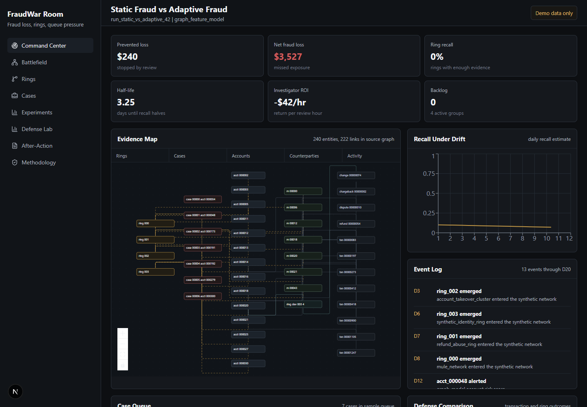
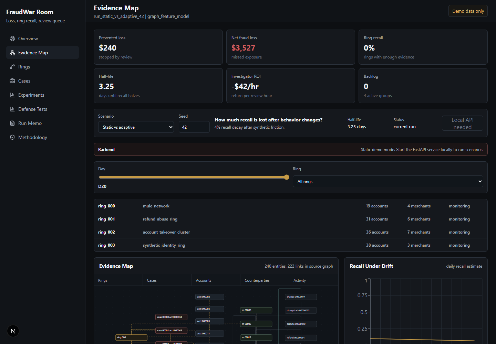
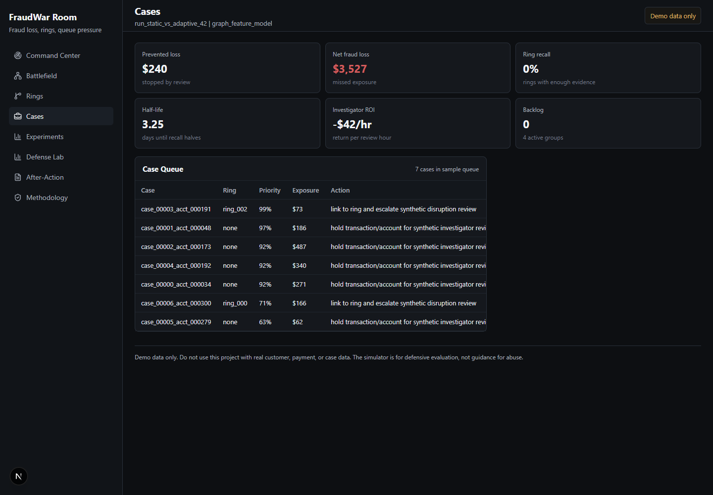
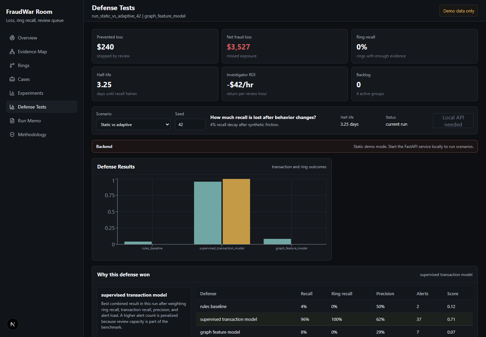
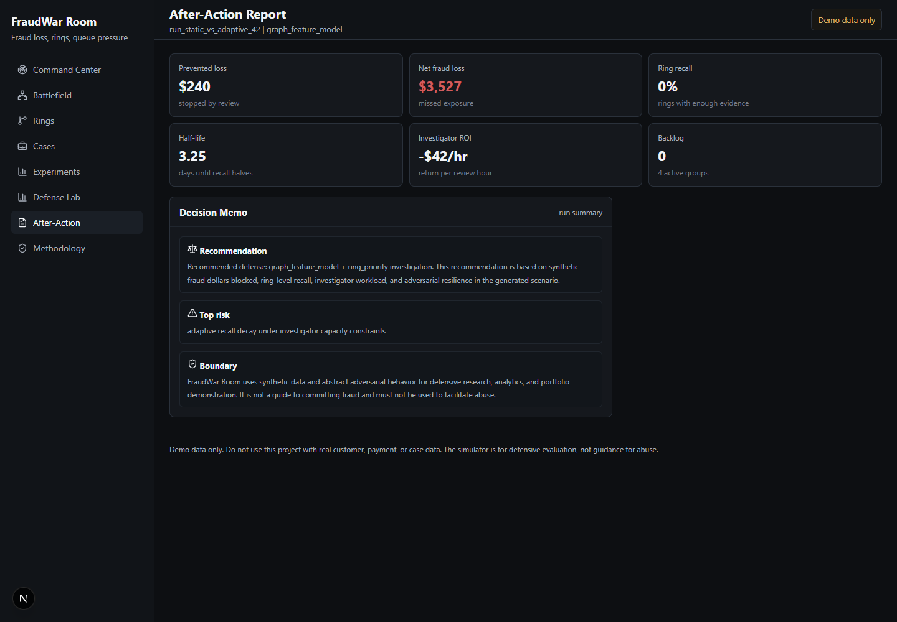

# FraudWar Room: Adaptive Fraud Simulation and Review Dashboard

## Problem

Fraud detection is often presented as static classification. Real financial-crime operations
also have to manage false positives, investigator workload, graph evidence, dollars saved,
and drift.

## Product Concept

FraudWar Room generates a synthetic payment network with accounts, merchants, devices,
transactions, refunds, chargebacks, synthetic rings, alerts, cases, and investigator queues.
Rings adapt abstractly after detection, and defenses are compared through the FraudArena
environment.

The public dashboard is hosted on GitHub Pages:

https://msaule.github.io/fraudwar-room/

GitHub Pages serves the static demo build. Live scenario runs, run history, benchmark jobs,
and SQLite persistence run through the local FastAPI service.

## Technical Architecture

- Python simulation package.
- FastAPI endpoints for experiments, scenario jobs, run history, benchmark reports, cases,
  rings, graph evidence, and health checks.
- Background scenario and benchmark jobs with run IDs, status polling, structured logs, and
  failure states.
- SQLite persistence for run payloads, metrics, report paths, job status, and benchmark
  summaries.
- NetworkX graph evidence.
- scikit-learn transaction and graph-feature models.
- Investigator queue and cost model.
- JSON, Markdown, and HTML run memos.
- Next.js dashboard.

## Screenshots

## Resume Bullets

- Built FraudWar Room, an adaptive fraud simulation and review dashboard that evaluates
  fraud defenses against synthetic fraud rings that change behavior after detection.
- Generated a synthetic payment network with accounts, merchants, devices, transactions,
  refunds, chargebacks, mule networks, collusive merchants, alerts, cases, and investigator
  workflows.
- Implemented rules-based, supervised, and graph-feature detection strategies, then evaluated
  them using fraud dollars missed, false-positive cost, investigator workload, ring-level
  recall, time-to-detection, and adversarial half-life.
- Built a dashboard with graph evidence, active ring timelines, case queues, defense
  results, and run memos.
- Added a working FastAPI run flow: the UI starts scenario jobs, polls status, persists
  results to SQLite, and shows prior runs with seeds, configs, metrics, and report links.
- Added multi-seed benchmark reporting to show variance in recall decay, backlog, ring
  recall, and investigator ROI.

## Limitations

The simulator is not a calibrated production model. It uses synthetic assumptions and should
be reviewed as a benchmark environment, not as a real fraud-control system.

The hosted GitHub Pages build is frontend-only. To run new scenarios from the UI, start the
FastAPI backend locally and set `NEXT_PUBLIC_API_BASE_URL`.
